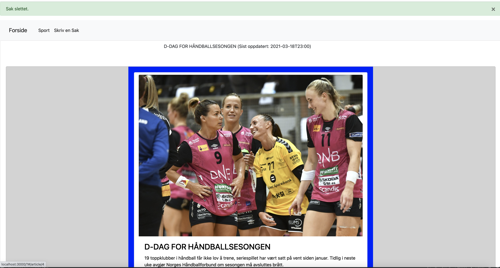
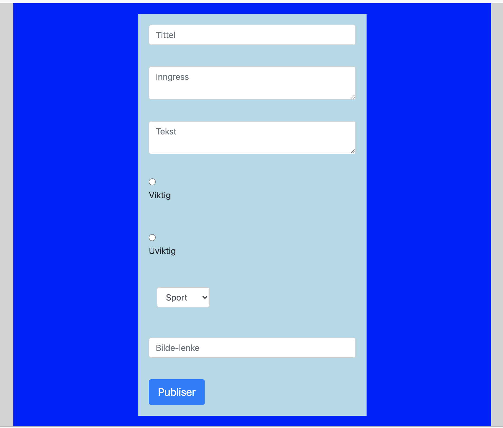
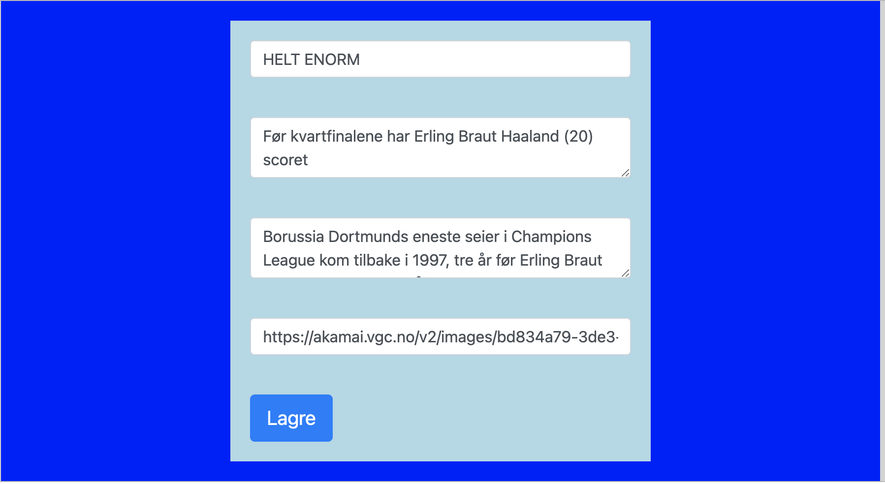

# TDAT-2003
 Miniproject from 2019. Getting introduced to JavaScript. The task was to create an online news paper. 
 P.S: This was my first web project😇

<h2>Quick start installation guide</h2>

```
git clone https://github.com/jonasbrunvoll/TDAT-2003.git

cd miniprosjekt/server
 
npm install
```

This will take some time.
```
npm start
```
This will start the server running on port 8080 on localhost of your machine.
```
cd ../client

npm install

npm start
```

And that's it! You can now use the website. 


<h2>Screenshots</h2>

Homepage


Add new article


Edit article 


